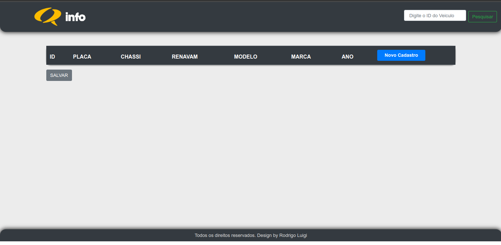
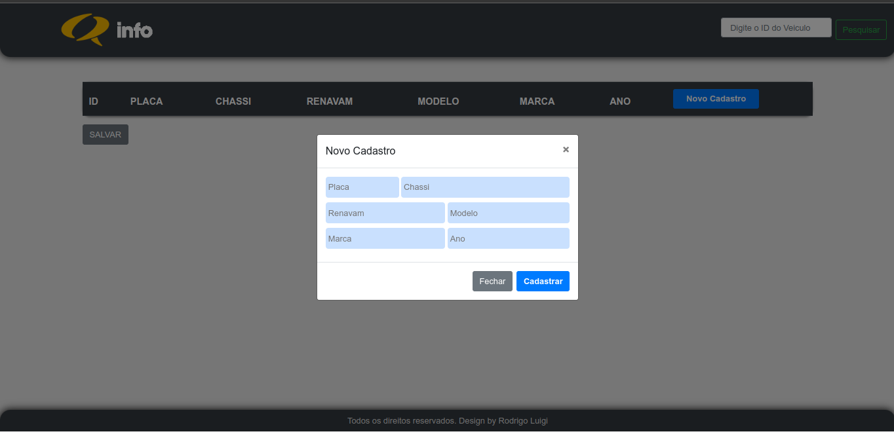
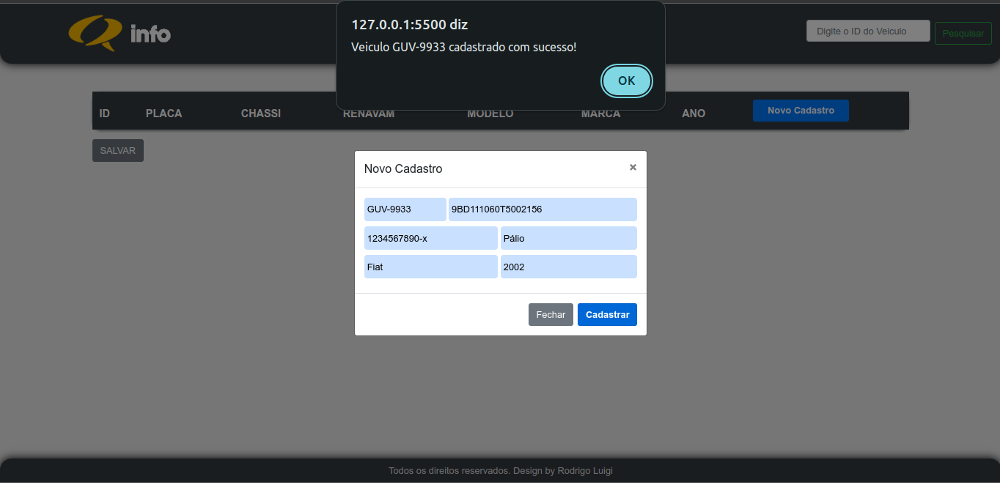

# <h1 id="top" align="center">Gerenciador de Veículos - Frond-end &nbsp; 🚗</h1>

<p align="center">
  <a href="#sobre">Sobre</a> &#xa0; | &#xa0; 
  <a href="#gear-features">Features</a> &#xa0; | &#xa0;
  <a href="#books-bibliotecas">Tecnologias</a> &#xa0; | &#xa0;
  <a href="#-requisitos">Requisitos</a> &#xa0; | &#xa0;
  <a href="#checkered_flag-iniciando">Iniciando</a> &#xa0; | &#xa0;
  <a href="https://github.com/RodrigoLuigi" target="_blank">Author</a>
</p>

<br>

## Screenshots

<div align="center">
  
  
  
</div>

<br><hr>

##  _**O que desenvolvemos neste Projeto?**_

📌 Aplicação para manipulação de dados inseridos em uma tabela através de um formulário, foi utilizado Banco de dados MySQL para armazenar informações de cada veiculo, e uma API para realizar requisições (HTTP) para o Front-end (html) , e dessa forma manipular os dados, criando novos cadastros (CREATE) , listando os dados cadastrados na tabela (READ) , atualizando os dados (UPDATE) e excluindo dados (DELETE).

Desenvolvido utilizando **HTML**, **CSS** e **JavaScript**.

## :gear: Features

:heavy_check_mark: Cadastro de permissão de usuário\
:heavy_check_mark: Cadastro de veículo\
:heavy_check_mark: Deletar veículo\
:heavy_check_mark: Editar veículo\
:heavy_check_mark: Listar veículos\
:heavy_check_mark: Listar veículo pelo id\

## :books: Bibliotecas

_**As seguintes bibliotecas foram utilizadas neste projeto:**_

- [jQuery](https://code.jquery.com/jquery-3.4.1.slim.min.js)
- [Popper.js](https://cdn.jsdelivr.net/npm/popper.js@1.16.0/dist/umd/popper.min.js)
- [Bootstrap](https://stackpath.bootstrapcdn.com/bootstrap/4.4.1/js/bootstrap.min.js)
- [FileSaver](https://github.com/eligrey/FileSaver.js)

## 📝 Requisitos

- [Git](https://git-scm.com)

## :checkered_flag: Iniciando

#### Inicializando aplicação Front-end

```bash
# Clone este projeto
$ git clone https://github.com/RodrigoLuigi/gerenciador-de-veiculos

# Acesse o projeto
$ cd gerenciador-de-veiculos/CRUD\ INFOSISTEMAS/

# Execute o projeto com Live server
http://127.0.0.1:5500/CRUD%20INFOSISTEMAS/
```

&#xa0;

_**Feito por <a href="https://github.com/RodrigoLuigi" target="_blank">Rodrigo Luigi</a>**_ 👨‍🚀

<a href="#top">Back to top</a>